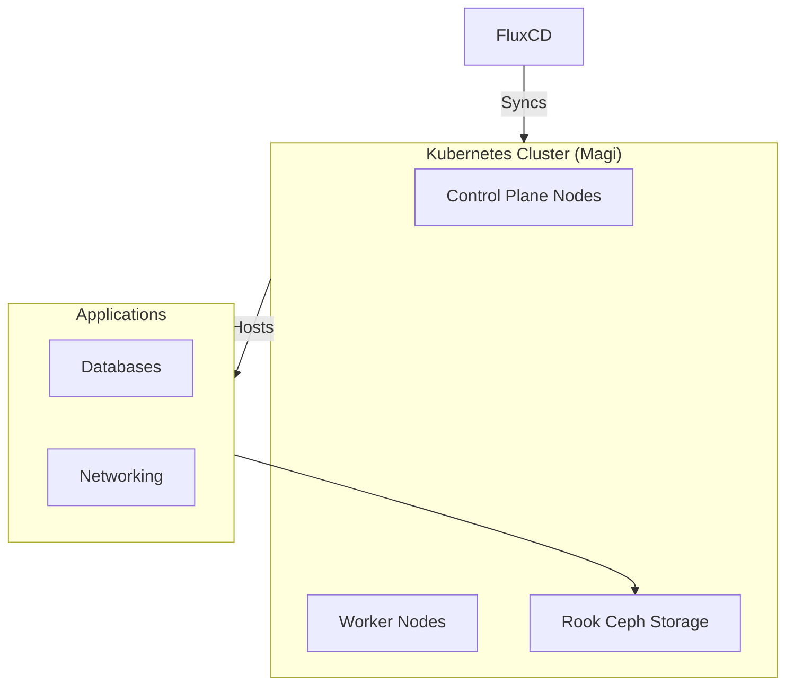

# homelab

Kubernetes home lab with Talos OS, FluxCD, and custom applications.

## Architecture

## Quick Start

1. **Deploy cluster**: See [cluster/magi/talos/](cluster/magi/talos/README.md)
2. **Bootstrap FluxCD**: `flux bootstrap github --owner=... --repository=homelab`
3. **Deploy apps**: `kubectl apply -k overlays/magi/databases/`

## Directory Structure

| Path | Purpose |
|------|---------|
| `apps/` | Base app definitions |
| `cluster/magi/` | Cluster-specific config + FluxCD |
| `overlays/magi/` | Per-cluster overlays |
| `containers/` | Custom Docker images |
| `network/` | Network docs |

## Security

- ✅ No plaintext secrets in git
- ✅ All secrets encrypted with SOPS + age
- ✅ Pre-commit hooks scan for leaks

## Documentation

- [Cluster Setup](cluster/README.md)
- [Apps](apps/README.md)
- [Overlays](overlays/README.md)
