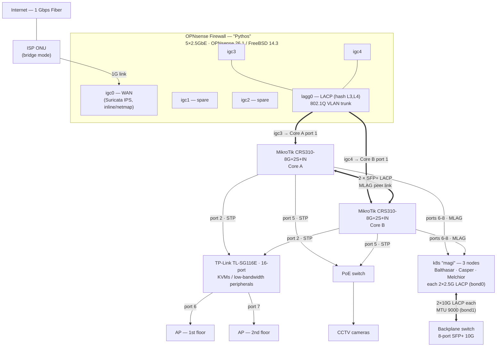

# Network Topology

Physical and logical topology of the homelab edge + core. This documents the
currently-deployed hardware only; more gear exists but is out of scope for now.

## Diagram

## Edge / WAN

| Item | Value |
|------|-------|
| ISP link | 1 Gbps fiber (verified ~940↓ / ~977↑ Mbit/s, 0% loss) |
| ONU | Bridge mode |
| WAN interface | `igc0` (2.5G port, negotiates 1000BASE-T to ONU) |
| IDS/IPS | Suricata, **inline IPS mode via netmap**, bound to `igc0` |

## OPNsense interfaces (igc0–igc4, all 2.5 GbE)

| Port | Role | Notes |
|------|------|-------|
| `igc0` | WAN | → ISP ONU; Suricata IPS inline |
| `igc1` | spare | no carrier (unused) |
| `igc2` | spare | no carrier (unused) |
| `igc3` | LAN bond member | → MikroTik Core (LACP) |
| `igc4` | LAN bond member | → MikroTik Core (LACP) |
| `lagg0` | LAN trunk | LACP bond of `igc3`+`igc4`, hash **L3,L4**; carries all VLANs |

## Core switching

- **2 × MikroTik CRS310-8G+2S+IN** (8 × 2.5GbE + 2 × SFP+ 10G) form the network
  core as an **MLAG** pair.
- The two **SFP+ ports** of each switch are bonded (LACP) as the **MLAG peer link**.
- OPNsense `lagg0` lands on **port 1** of each switch (`igc3`→Core A, `igc4`→Core B),
  forming one logical LACP/MLAG uplink — redundancy + aggregate bandwidth.
- A single TCP flow uses **one** 2.5G member (per L3/L4 hash); aggregate across
  flows can use both.
- Downstream devices attached to **both** cores (that aren't MLAG bonds) rely on
  **STP** to break loops.

### Core switch port map (identical on Core A & Core B)

| Port(s) | Connects to | VLANs | Notes |
|---------|-------------|-------|-------|
| `1` | OPNsense firewall | trunk (10/15/20/25/500) | LACP uplink; A+B = MLAG bond to `lagg0` |
| `2` | TP-Link TL-SG116E (16-port) | 15, 20, 25, 500 | KVMs / peripherals + APs downstream; dual-homed (STP) |
| `3`, `4` | — | — | free / spare |
| `5` | PoE switch → CCTV cameras | 25 | dual-homed (STP) |
| `6`–`8` | k8s "magi" nodes (1 per port) | trunk 10, 15, 20, 25 | **MLAG**; each node bonds 2×2.5G (LACP) across both cores |
| `SFP+1`, `SFP+2` | peer core switch | — | LACP, MLAG peer link |

## VLANs

| VLAN | Subnet (IPv4) | IPv6 (ULA) | Gateway (v4 / v6) | Purpose |
|------|---------------|------------|-------------------|---------|
| 10  | `10.1.0.0/22`     | `fd7a:2201:1ab::/64`  | `10.1.0.1` / `::1`    | Servers |
| 15  | `172.16.15.0/24`  | `fd7a:2201:ca5a::/64` | `172.16.15.1` / `::1` | Home phones, PCs, streaming |
| 20  | `172.16.20.0/24`  | —                     | `172.16.20.1`         | IoT (switches, lights, etc.) |
| 25  | `172.16.25.0/24`  | —                     | `172.16.25.1`         | Security cameras |
| 500 | `10.0.0.0/24`     | `fd7a:2201:5e72::/64` | `10.0.0.1` / `::1`    | Management (switches, routers, APs, firewall) |

> VLANs 10, 15 and 500 are dual-stack (IPv4 + IPv6 ULA). VLANs 20 and 25 are IPv4-only.

### Management addressing (VLAN 500 — `10.0.0.0/24` · `fd7a:2201:5e72::/64`)

| Device | IPv4 | IPv6 |
|--------|------|------|
| OPNsense firewall | `10.0.0.1` | `::1` |
| Core A (CRS310) | `10.0.0.4` | `fd7a:2201:5e72::4` |
| Core B (CRS310) | `10.0.0.5` | `fd7a:2201:5e72::5` |
| TP-Link TL-SG116E | `10.0.0.6` | — |
| AP — 1st floor | `10.0.0.7` | `fd7a:2201:5e72::7` |
| AP — 2nd floor | `10.0.0.8` | `fd7a:2201:5e72::8` |

> Both APs uplink to the **TP-Link** (ports 6 & 7), trunking VLANs 15/20/25/500.
> The TP-Link's uplink to the core (port `2`) therefore trunks those same VLANs.

## Compute — Kubernetes cluster "magi"

3 × Talos nodes named after the Magi: **Balthasar**, **Casper**, **Melchior**.
Controlplane VIP `fd7a:2201:1ab::5` (Layer-2 VIP on `bond0`), API endpoint
`https://magi.vbalex.com:6443`.

Each node has two bonds (both LACP / 802.3ad):

- **`bond0` — 2 × 2.5GbE → core switches** (ports 6–8, MLAG). Trunk for VLANs
  10/15/20/25; node management address sits on VLAN 10 (servers).
- **`bond1` — 2 × 10G SFP+ → dedicated backplane switch** (MTU 9000). Carries the
  cluster/storage networks (see below).

| Node | VLAN 10 (server) | IPv6 (VLAN 10) | Backplane `bond1` |
|------|------------------|----------------|-------------------|
| Balthasar | `10.1.0.6/22` | `fd7a:2201:1ab::6` | `10.255.0.1/29`, `fd7a:2201:7351::1` |
| Casper    | `10.1.0.7/22` | `fd7a:2201:1ab::7` | `10.255.0.2/29`, `fd7a:2201:7351::2` |
| Melchior  | `10.1.0.8/22` | `fd7a:2201:1ab::8` | `10.255.0.3/29`, `fd7a:2201:7351::3` |

### Cluster backplane (inter-node)

Dedicated **8-port SFP+ 10G switch**, MTU 9000, isolated from the core. Each node
uplinks with 2 × 10G LACP (`bond1`). On top of `bond1`:

| Network | VLAN | Subnet | Purpose |
|---------|------|--------|---------|
| storage (`br-storage`, `bond1.2`) | 2 | `10.255.254.0/24` | storage traffic |
| RWX (`br-rwx`, `bond1.3`)         | 3 | `10.255.255.0/24` | shared (RWX) storage |
| backplane base (`bond1`)          | —  | `10.255.0.0/29` · `fd7a:2201:7351::/64` | node-to-node |

Backplane switch port map:

| Ports | Node |
|-------|------|
| `1`, `2` | Balthasar |
| `3`, `4` | Casper |
| `5`, `6` | Melchior |

## Notes

- **Performance**: WAN saturates ~940↓ / ~977↑ Mbit/s with ~2.5 ms idle latency
  and negligible bufferbloat.
- **Suricata** runs inline (netmap) on WAN; on the OPNsense box this is the main
  latency-sensitive component to watch under heavy load.
- **FQ-CoDel shaper** active on WAN (`igc0`): **950↑ / 930↓ Mbit**, FQ-CoDel
  (target 5 ms, ECN). Flattens latency under sustained bulk transfers — upload
  loaded latency ~6 ms (was ~16 ms); ~5–8% peak throughput traded for it.

---
_Out of scope for now: additional hardware not yet documented._
